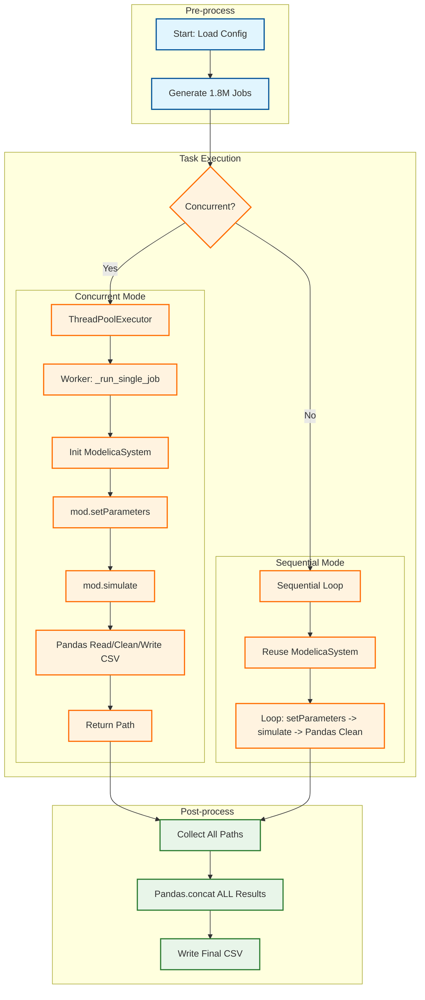
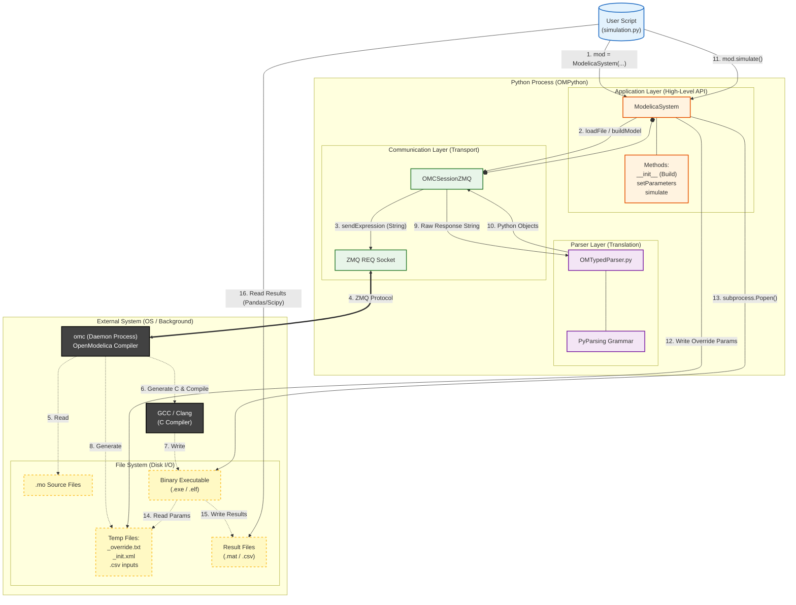

# TRICYS Performance Bottleneck Analysis
## Background
The CFEDR analysis report fitting formula section requires calculating a large number of training samples. The required TRICYS configuration is as follows:
```json
{
    "paths": {
        "package_path": "./CFEDR2.mo"
    },
    "simulation": {
        "model_name": "CFEDR.Cycle",
        "variableFilter": "time|sds.inventory",
        "stop_time": 24000.0,
        "step_size": 1
    },
    "simulation_parameters": {
        "pulse.power": [100, 200, 500, 1000, 1500, 2000, 2500, 3000],
        "pulse.width": [0.5, 0.6, 0.7, 0.8, 0.9, 0.99],
        "pulse.period": [0.33, 0.5, 1, 1.5, 2, 2.5, 3],
        "plasma.Burn_Fraction": [0.02, 0.03, 0.04, 0.05, 0.06, 0.07, 0.08, 0.09, 0.1],
        "plasma.Fueling_Efficiency": [0.1, 0.2, 0.3, 0.4, 0.5, 0.6, 0.7, 0.8, 0.9, 0.98],
        "bz.TBR": [1.05, 1.1, 1.15, 1.2],
        "tep.DIR": [0, 0.05, 0.1, 0.15, 0.2, 0.3, 0.4, 0.5, 0.6, 0.7, 0.8, 0.85, 0.9, 0.95, 1]
    }
}
```

With 7 parameters total and a Cartesian product combination, it generates `8 * 6 * 7 * 9 * 10 * 4 * 15 = 1,814,400` simulation jobs.

  * **Time Bottleneck**: For sequential execution, a single task takes about 30s. Estimated total time: `30 * 1814400 / 60 / 60 / 24 = 630 days`, which is unacceptable.
  * **Space Bottleneck**: 15 simulation results in CSV format take ~135MB (9MB per task). Estimated total space: `9 * 1814400 / 1024 / 1024 = 15.619 TB`, far exceeding typical server capacity.
  * **Concurrency Crashes**: Concurrent execution crashes frequently with `Assertion failed: error not defined [8] ... libzmq-src\src\ip.cpp:464`. This indicates ZeroMQ (the communication layer for OpenModelica) has race conditions or resource exhaustion in multi-threaded environments.

Thus, TRICYS needs a performance bottleneck analysis and overhaul to fully exploit computational resources.

## Code Overview
The core logic of `simulation.py (TRICYS base simulation)` includes three parts: pre-process, task execution, and post-process.
1. Pre-process parses the config and generates the task list for parameter sweeping.
2. Execution core: `mod = ModelicaSystem(...)`, `mod.setParameters(...)`, `mod.simulate(...)`.
3. Post-process merges results and handles custom logic.



## Performance Bottlenecks
### CPU Profiling
#### VizTracer Analysis
```python
from viztracer import VizTracer
tracer = VizTracer(output_file="concurrent_trace.json", min_duration=1000)
tracer.start()

run_simulation(config)

tracer.stop()
tracer.save() 
```

Summary:
1. OMPython uses ZeroMQ to communicate with the `omc` server (daemon), parsing result strings back into Python objects.
2. The most time-consuming part is `buildModel()` during `ModelicaSystem` initialization, where `omc` parses Modelica code into C and calls `gcc` to compile it.
3. `simulate()` reuses the generated executable via `_excute_child()` subprocess calls.
4. `setParameters()` is negligible.


Summary:
1. Each thread starts its own `omc` server. While they should be isolated, high thread counts still cause crashes.
2. Lack of `mod` object reuse means the expensive `buildModel()` step consumes >50% of CPU resources in every thread.



#### OMPython Code Analysis
OMPython's architecture isn't built for high-frequency, short-cycle massive concurrency.
**1. Client-Server Architecture**
* **Overhead**: Every API call requires string serialization/deserialization over ZMQ.
* **Parsing**: Results are Modelica strings (e.g., `{1.0, 2.0}`) parsed by `OMTypedParser.py`. This is slow for high-frequency calls.
* **Concurrency**: `OMCSessionZMQ` is not thread-safe, leading to `libzmq` crashes in `ThreadPoolExecutor`.

**2. `ModelicaSystem(...)`: Expensive Initialization**
Initializing a `ModelicaSystem` object triggers a full compilation pipeline: `loadFile`, `loadModel`, `buildModel` (C generation + GCC compile), and XML parsing of `_init.xml`. This is the primary bottleneck.

**3. `setParameters(...)`: Lightweight Mem-Op**
This only updates local Python dictionaries and is very fast (microseconds).

**4. `simulate(...)`: Hidden I/O Bottleneck**
Uses a "file-based parameter passing" mechanism. Every simulation writes an `_override.txt` file. For 1.8M tasks, this creates 1.8M small-file I/O operations, causing an "I/O storm".

#### Improvement Ideas
* **Sequential**: Limited gains, already reuses executables.
* **Concurrent**: Huge potential. **"Compile Once, Run Many"**.
    * **Bypass OMPython**: Don't instantiate `ModelicaSystem` in workers.
    * **Direct EXE Calls**: Compile once in the main process, then call the EXE directly via `subprocess` with `-override` flags in workers, bypassing OMC and ZMQ entirely.

### Memory Profiling
#### Issues
1. **OOM Risk**: `pd.concat(all_dfs, axis=1)` for 1.8M tasks would need terabytes of RAM.
2. **Resource Leak**: Unmanaged Futures in `ThreadPoolExecutor` accumulate memory.

#### Improvement Ideas
* **Streaming**: Use **HDF5** for layered storage.
* **Instant Release**: Run task -> read result -> write to HDF5 -> **immediately free memory and delete temp files**.

### Disk and I/O Profiling
#### Issues
1. **Inifficient CSV**: CSV is >2x the size of MAT (135MB vs 72MB). 15.6TB of writing will kill SSD lifespans.
2. **Small-file Storm**: Millions of temp files are a nightmare for NTFS.
3. **Log Overhead**: Logging at `INFO` level adds significant I/O overhead.

#### Improvement Ideas
* **Binary Format**: Use `.mat` throughout.
* **HDF5 Compression**: Use HDF5 (Blosc) to compress 15TB down to ~3TB.
* **Disk Isolation**: Separate OS/temp files and data storage on different physical drives.

## Roadmap
### Short-term (2-3 weeks)
#### 1. Core Architecture Upgrade
* **Single Compilation**: Use `ModelicaSystem` once to get the `.exe` path.
* **`subprocess` Scheduler**: Lightweight worker calling the EXE directly: `./EXE -override p1=v1 -r result.mat`. Use `ProcessPoolExecutor` to fix ZMQ crashes.
* **Throttling**: Add license-aware workers if needed.

#### 2. Data Flow Optimization
* **MAT Output**: Change `outputFormat` to `mat`.
* **Streaming Archive**: Read MAT -> Write HDF5 -> Delete MAT instantly.

### Long-term
#### 3. Task-level Caching (Proxy)
Implement a cache layer generating unique hashes for `job_params`. Skip simulations if a hash already exists in the cache.

## Hardware Recommendation
For 1.8M tasks on Windows with Aspen/COMSOL:

| Component | Suggestion | Reason |
| :--- | :--- | :--- |
| **CPU** | **Dual Socket**, **128+ Cores / 256+ Threads**, ≥ 3.0 GHz, 128 PCIe lanes | **Cores = Productivity**. Dual sockets allow 200+ concurrent processes. |
| **RAM** | **512 GB** (Rec: 1 TB), DDR5 ECC 12-Channel | 200 instances of Aspen/COMSOL consume 1-2GB each. High bandwidth is critical. |
| **Storage** | **2 x 4TB Enterprise NVMe** (U.2), **DWPD ≥ 3** | High durability is required for massive I/O. Isolate temp files and storage. |
| **GPU** | **16 GB+** GDDR6, Professional Card | Handles 200+ background task graphical requirements without system lag. |
| **OS** | **Windows Server 2022** | Better NUMA scheduling and process stability for 24/7 loads. |
