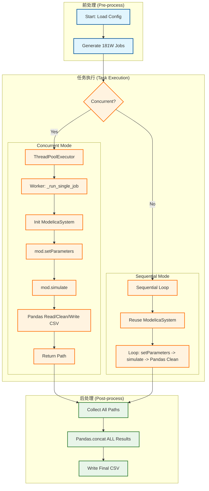
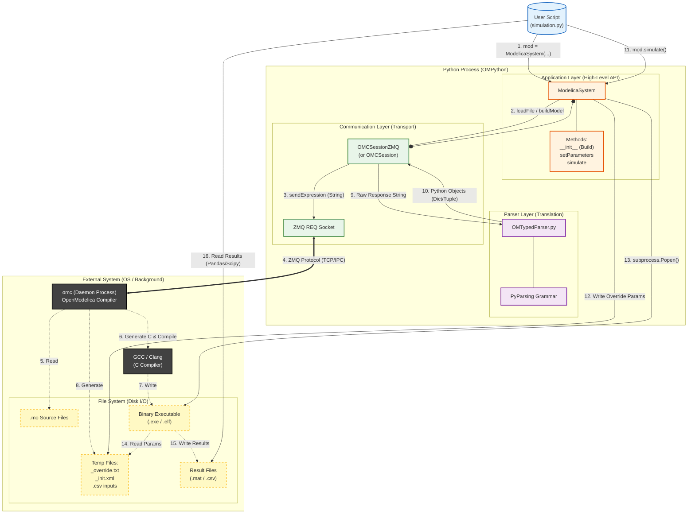

# TRICYS性能瓶颈分析
## 分析背景
CFEDR分析报告拟合公式小节中需要计算大规模的训练样本，TRICYS所需配置如下：
```json
{
    "paths": {
        "package_path": "./CFEDR2.mo"
    },
    "simulation": {
        "model_name": "CFEDR.Cycle",
        "variableFilter": "time|sds.inventory",
        "stop_time": 24000.0,
        "step_size": 1
    },
    "simulation_parameters": {
        "pulse.power": [100, 200, 500, 1000, 1500, 2000, 2500, 3000],
        "pulse.width": [0.5, 0.6, 0.7, 0.8, 0.9, 0.99],
        "pulse.period": [0.33, 0.5, 1, 1.5, 2, 2.5, 3],
        "plasma.Burn_Fraction": [0.02, 0.03, 0.04, 0.05, 0.06, 0.07, 0.08, 0.09, 0.1],
        "plasma.Fueling_Efficiency": [0.1, 0.2, 0.3, 0.4, 0.5, 0.6, 0.7, 0.8, 0.9, 0.98],
        "bz.TBR": [1.05, 1.1, 1.15, 1.2],
        "tep.DIR": [0, 0.05, 0.1, 0.15, 0.2, 0.3, 0.4, 0.5, 0.6, 0.7, 0.8, 0.85, 0.9, 0.95, 1]
    }
}
```

总计 7 个参数，每个参数之间采用笛卡尔积的组合方式共生成 `8 * 6 * 7 * 9 * 10 * 4 * 15 = 1,814,400` 个仿真任务。

  * **时间瓶颈**：对于 TRICYS 的顺序执行，从日志文件可以看出单个仿真任务计算需要 30s，估计总计算时长 `30 * 1814400 / 60 / 60 / 24 = 630 days`，这是不可接受的。
  * **空间瓶颈**：实测显示，CSV 格式下 15 个仿真输出结果约 135MB（单任务 9MB），估计所需总存储空间 `9 * 1814400 / 1024 / 1024 = 15.619 TB`，远超常规服务器存储容量。
  * **并发崩溃**：对于 TRICYS 的并发执行，程序频繁崩溃，日志提示 `Assertion failed: error not defined [8] ... libzmq-src\src\ip.cpp:464`。这表明 ZeroMQ 底层库（OpenModelica 的通信层）在多线程环境下存在严重的竞态条件或资源耗尽问题。

综上所述，TRICYS 必须进行性能瓶颈分析及改进，以支持程序层面对计算资源的全面压榨。

## 代码概述
`simulation.py（TRICYS 基础仿真）`核心逻辑包括三个部分：前处理(pre-process)，任务执行，后处理(post-process)。
1. 前处理主要解析配置文件并生成参数扫描的仿真任务列表
2. 任务执行的核心代码为`mod = ModelicaSystem(...)`,`mod.setParameters(...)`,`mod.simulate(...)`
3. 后处理主要合并仿真结果以及自定义处理逻辑。




## 性能瓶颈
### CPU性能剖析
#### VizTracer分析
```python
from viztracer import VizTracer
tracer = VizTracer(output_file="concurrent_trace.json",min_duration=1000)
tracer.start()

run_simulation(config)

tracer.stop()
tracer.save() 
```

总结：
1. OMPython底层设计是使用 ZeroMQ 通信中间件与omc服务端（守护进程）传递命令，由omc返回结果后再解析字符串为python对象。
2. 最耗时的操作是初始化ModelicaSystem对象中的buildModel()环节，该环节耗时原因是omc对modelica源码解析成C代码并调用gcc编译器进行编译生成.exe/elf可执行文件。
3. simulate()函数实际上是复用了.exe/elf可执行文件，使用_excute_child()起子进程调用
4. setParameters()函数忽略不计


总结：
1. 每个子线程在初始化ModelicaSystem对象中起一个omc服务端，常理来说不会发生竞争状态，线程数量过多仍会报错
2. 每个子线程没有复用mod对象，导致最耗时的buildModel()环节占用了每个子线程一半以上的计算资源




#### OMPython代码剖析
通过阅读 `OMPython` 库的源代码，发现其底层架构设计并不适合高频、短周期的海量并发任务。以下是针对核心组件和方法的源码级性能分析：

**1. 架构设计：客户端-服务器 (Client-Server) 通信**

OMPython 本质上是一个“瘦客户端”，它通过 **ZeroMQ (ZMQ)** 或 CORBA 协议与后台的 OpenModelica 编译器 (OMC) 守护进程进行通信。
* **通信开销**：每一次 API 调用（如 `sendExpression`），都需要将 Python 字符串序列化，通过 Socket 发送给 OMC，OMC 执行后再将结果序列化传回。
* **解析开销**：接收到的结果通常是 Modelica 语法的字符串（如 `{1.0, 2.0}`），需要通过 `OMTypedParser.py` 进行正则解析和类型转换。对于高频调用，这种“字符串<->对象”的转换占据了大量 CPU 时间。
* **并发缺陷**：`OMCSessionZMQ` 类中的 Socket 连接并不是线程安全的。TRICYS 尝试在多线程 (`ThreadPoolExecutor`) 中并发调用同一个或多个 Session，直接导致了底层的 `libzmq` 断言失败和程序崩溃。

**2. `ModelicaSystem(...)`：昂贵的初始化**

实例化了一个新的 `ModelicaSystem` 对象不仅是简单的对象创建，而是包含了完整的“编译流水线”：
* **加载与解析**：调用 `loadFile` 和 `loadModel` 将模型源码读入内存。
* **构建 (Build)**：调用 `buildModel` API。这会触发 C 代码生成和 GCC/Clang 编译，生成可执行文件 (`.exe`) 和 XML 初始化文件。
* **XML 解析**：调用 `xmlparse()` 方法，解析生成的 `_init.xml` 文件，将其中的数千个变量映射到 Python 字典中。
* **性能结论**：这是一个极度消耗 CPU 和 I/O 的操作。在循环或并发任务中重复执行此步骤是 TRICYS 最大的性能杀手。

**3. `setParameters(...)`：轻量级的字典操作**

与直觉相反，`setParameters` 方法本身并不与 OMC 通信，也不会触发重编译，因此**不是性能瓶颈**。
* **源码逻辑**：该方法仅将用户传入的参数键值对更新到 `self.overridevariables` 这个 Python 字典中。
* **性能结论**：该操作是纯内存操作，耗时极短（微秒级），可以放心高频使用。

**4. `simulate(...)`：隐蔽的 I/O 瓶颈**

虽然 `simulate` 方法复用了已编译的 `.exe` 文件（避免了重编译），但其源码实现中包含大量低效的文件 I/O 操作，在大规模并发下引发“I/O 风暴”：
* **Override 文件写入**：每次仿真前，它会将 `self.overridevariables` 中的所有参数写入一个临时的 `_override.txt` 文件。硬盘读写速度远慢于内存传参。
* **CSV 输入生成**：如果涉及输入变量，会调用 `createCSVData()` 将数据写入 CSV 文件。
* **性能结论**：`simulate` 的瓶颈在于“文件传参”机制。在 180 万次任务中，这会导致 180 万次小文件的创建、写入和关闭，严重拖慢整体速度。

#### 改进思路

  * **顺序执行**：改进空间有限，受限于单核性能，已经复用了.exe执行文件。
  * **并发执行**：改进空间极大。核心策略是 **"Compile Once, Run Many"（编译一次，运行多次）**。
      * **剥离 OMPython**：不再在 Worker 中实例化 `ModelicaSystem`。
      * **直接调用 EXE**：主进程编译一次获取 `.exe` 路径，Worker 进程通过 `subprocess` 直接调用该 EXE，并通过命令行参数 `-override` 传参，彻底绕过 OMC 和 ZMQ。

### 内存性能剖析

#### 存在的问题

1.  **结果合并的内存爆炸 (OOM Risk)**
    代码最后尝试 `combined_df = pd.concat(all_dfs, axis=1)`。对于 180 万个任务，这意味着试图将几 TB 的数据一次性读入内存，必然导致内存溢出。
2.  **线程池内存累积**
    `ThreadPoolExecutor` 中未及时清理的 Future 对象和结果路径列表也会占用可观内存。

#### 改进思路

  * **流式处理 (Streaming)**：放弃一次性合并。采用 **HDF5** 分层存储结构。
  * **即时归档与释放**：仿真完成一个任务 -\> 读取结果 -\> 写入 HDF5 -\> **立即释放内存并删除临时文件**。

### 磁盘及 I/O 读写剖析

#### 存在的问题

1.  **CSV 格式低效**
    实测显示 CSV 格式体积是 MAT 格式的 **2 倍以上**（135MB vs 72MB）。15.6 TB 的总写入量会耗尽磁盘寿命并阻塞 I/O。
2.  **小文件风暴**
    180 万次任务会产生数百万个临时文件（CSV, MAT, XML, LOG），频繁的创建与删除操作是 NTFS 文件系统的噩梦。
3.  **Log 日志输出**
    过高的日志级别（INFO）在高频循环中会产生大量 I/O 开销。

#### 改进思路

  * **二进制格式**：全流程改用 OpenModelica 默认的 `.mat` 格式，体积减半。
  * **HDF5 压缩**：最终存储采用 HDF5 (Blosc 压缩)，预计可将最终体积压缩至 **3 TB** 左右。
  * **物理隔离**：系统/临时文件与数据存储分盘处理。

## 改进计划

### 短期计划（2-3周）
#### 1\. 核心架构升级

  * **废弃 `ModelicaSystem` 循环调用**：仅在脚本开始时使用 `ModelicaSystem` 进行**一次**模型编译 (`buildModel`)，获取 `.exe` 文件路径。
  * **实现 `subprocess` 调度器**：
      * 编写轻量级 Worker 函数，仅接收参数字典和 EXE 路径。
      * 构造命令行指令：`./CFEDR_Cycle.exe -override param1=val1,param2=val2 -r result.mat`。
      * 使用 `ProcessPoolExecutor` (多进程) 替代 `ThreadPoolExecutor` (多线程)，彻底根治 ZeroMQ 崩溃问题。
      * 引入 **License 感知的限流机制**：若商业软件 Token 有限，需限制 `max_workers` 并增加重试逻辑。

#### 2\. 数据流优化

  * **输出格式变更**：将 `outputFormat=csv` 改为 `mat`。
  * **流式归档**：主进程使用 `pd.HDFStore`，在任务完成的瞬间读取 MAT，写入 HDF5，并**立即删除源文件**。

### 长期计划 

#### 3\. 任务级缓存机制（代理机制）

  *   **动作:** 在任务执行器中增加一个缓存层（代理层）。
  *   **实现:** 在执行每个 `job_params` 对应的任务前，先根据其参数内容生成一个唯一的哈希值（或字符串标识）。检查结果目录中是否存在与此哈希对应的结果文件。如果存在，则直接跳过该任务的仿真，复用已有结果。
  *   **收益:** 避免重复运行完全相同的仿真任务，在调试或多次运行相似分析时节省大量时间与计算资源。

## 硬件配置清单

基于 180 万任务量及 Windows 环境下 Aspen/COMSOL 协同仿真的需求，推荐以下配置：

| 组件 | 核心参数指标建议 | 关键理由 |
| :--- | :--- | :--- |
| **CPU** | **架构**：双路（Dual Socket）服务器架构<br>**核心数**：总计 **128 核 / 256 线程** (或更高，如 192核)<br>**主频**：全核满载频率 ≥ 3.0 GHz<br>**PCIe通道**：128条 PCIe 4.0/5.0 通道 | **License 充足意味着“核心数 = 生产力”**。双路 CPU 能提供极致的线程密度，配合您的 Python `multiprocessing`，可以同时开启 200+ 个仿真进程，比单路工作站快 3-4 倍。大量的 PCIe 通道用于喂饱高速硬盘。 |
| **内存** | **容量**：**512 GB** (推荐) 或 **1 TB**<br>**类型**：DDR5 ECC Registered (RDIMM)<br>**通道**：**12 通道** (必须插满所有通道) | 并发跑 200 个 Aspen/COMSOL 实例会消耗惊人的内存（每个实例约 1-2GB）；且双路 CPU 需要巨大的内存带宽来避免数据传输瓶颈。**512GB 是起步安全线**。 |
| **硬盘** | **容量**：**2 块 × 4TB (总物理容量 8TB)**<br>**类型**：**企业级 (Enterprise)** NVMe SSD (U.2 接口最佳)<br>**耐用度**：**DWPD ≥ 3** (写入密集型)<br>**IOPS**：随机写入 \> 200,000 | 在高并发下，200 个进程同时写日志和结果，I/O 压力是之前的数倍。**必须选用高耐用度 (Write Intensive)** 的企业盘。建议物理隔离：盘A做系统/临时交换，盘B做 HDF5 最终存储。 |
| **GPU** | **显存**：**16 GB** (或 24 GB) GDDR6<br>**类型**：中高端专业绘图卡<br>**驱动**：支持 OpenGL / DirectX 专业驱动 | 虽然主要靠 CPU 计算，但在 200 个并发任务后台运行时，如果你需要通过远程桌面查看某个任务的图形结果，大显存显卡能保证系统界面不卡顿、不黑屏。 |
| **系统** | **版本**：**Windows Server 2022 (64位)**<br>**授权**：数据中心版 (Datacenter) 或 标准版 (Standard) | 只有 Server 版操作系统能完美调度双路 CPU 的 NUMA 架构，并稳定管理数百个后台进程而不强制休眠或重启。 |

